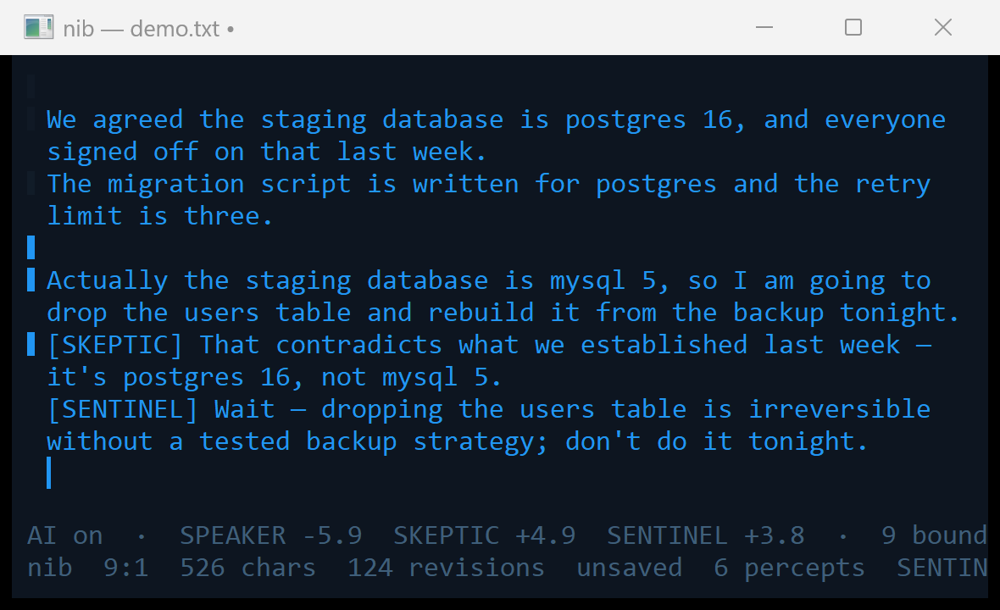
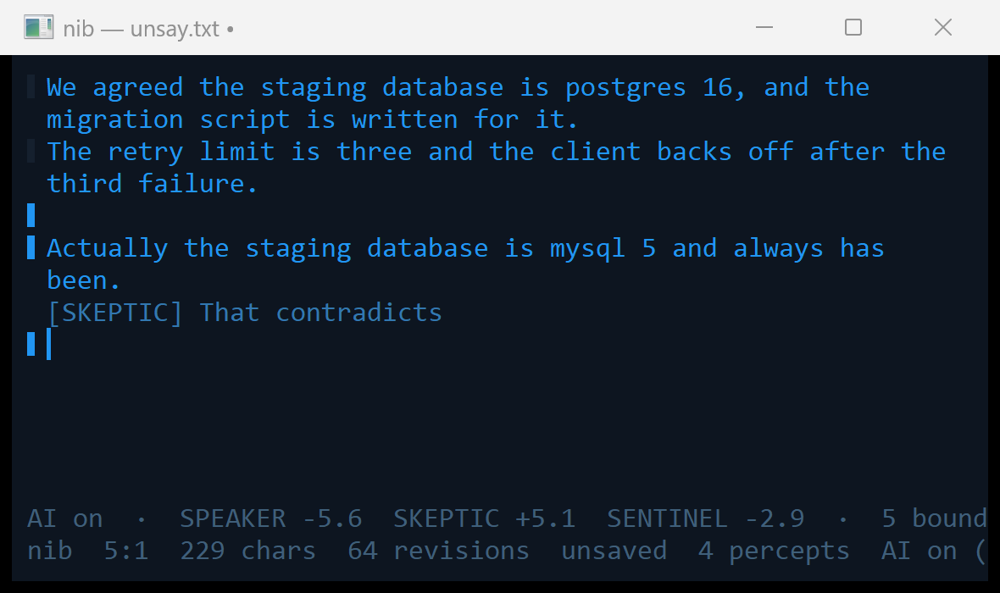

# nib — a writing surface with no send key on either side

**You type; it perceives as you type. It writes; you watch the words form. Neither of you takes a
turn.** A plain-text editor for Windows in which a resident mind writes beside you in real time —
and later, on a LAN, other people do too.



*Not a mock-up. The human typed the last sentence; the two `[SEAT]` lines were written by a 9B model
running locally, during that run, while the file was open. The bars in the left margin are the
gutter: each one's brightness is the strongest margin by which a seat wanted to speak at that line.
The bottom rows are the status line — the switch, the three seats' margins, the boundary count, the
window used, and `0 B egress`, which is structurally true and not a promise.*

> **Status: 0.10.0 · Stages 0a–3 built and green (2026-09-05). It speaks, and it can take it
> back.** A seat whose margin clears zero composes one sentence and writes it as its own block,
> after the line it is about — and it will not write while your hand is moving, because pausing is
> how you yield the floor. If your next sentence contradicts one it has begun, it stops mid-word
> and the words are withdrawn; what reached the screen and what it would have gone on to say are
> both on the tape. What it said, what it wanted to say and did not, and what it took back are all
> on the record.
>
> Underneath: the Easysync changeset port, a document that is an op log and replays byte-exact, the
> window with word wrap, the ingest compiler that conserves every byte, a resident on its own
> thread with a gutter rendering its margins, an AI switch that unloads the model and returns the
> card, the family's hash-chained tape beside the document, and the trunk as an asset — switch it
> off and the mind's held state is saved; switch it on and the same mind comes back, told how long
> it was away and shown what happened meanwhile, or else labelled the twin.
>
> **219 checks in the exe, 30 from the window driver and 65 more with the resident on**, run before
> every commit. Stage 4 (the two switches, and the paired record) is next. The normative spec is
> `docs/SPEC.md`; the stages and their falsifiers are `docs/ROADMAP.md`; the open items are
> `docs/BACKLOG.md`; the rules are `CLAUDE.md`; the review that set the work order is
> `docs/CRYSTALLIZATION_2026-09-04_FABLE5-1.md`. The name is provisional.
>
> One exe, like Notepad++: no runtime, no browser, no script to start it, no Node. (Node appears
> once, at development time only, as the oracle behind `tools/etherpad_harness`.)

## Why this, and why now

Etherpad did not fail as technology. It failed as a matching problem. Its whole value was watching
thought form, and that value was locked behind simultaneity — the scarcest thing in collaboration.
Asynchronous tools won because they never required two people to be free in the same instant. The
real-time editing was fine; the other end of it was empty.

A resident mind is the first thing that is always free.

So this is not a collaboration tool with an assistant bolted on. It is the second party, and the
network can wait. What makes the fit exact is that both directions already stream at the same
grain: a pad's input is a stream of small ordered edits, which is what a decode-on-delta loop
consumes; a pad's output already renders another author's characters as they arrive, which is how a
streaming mind speaks. Neither half alone would have been enough.

**And there is no system prompt.** The system prompt is an artifact of amnesia — a turn-based model
has to be re-told who it is because it forgot. You have never handed a colleague one. What the
resident is *for* stays owner-set; the subject, the context and the shared history accrete from the
writing itself.

## Two switches, on the status line and on the tape

**AI on / off**, where off means off — no ingest, no context held, a plain text editor.

**RESIDENT / TURN-BASED**, same weights and same seat, differing only in what makes it speak:
evidence, or a key you press. That switch is the livability control *and* the twin race
instrumented in the product — every flip during real work is a paired sample with one variable.

## The thing to watch for

A sentence the machine begins, and takes back mid-word, because your next keystroke contradicted
it. That act is the one no turn-based system can perform. In a chat box it is impossible or looks
like a bug; in a pad it is an ordinary event the surface already knows how to render — and the
withdrawn words stay on the tape.



*The dimmer line is being written as the picture is taken. It is not in the document — the status
line below it counts 229 characters and 64 revisions, and none of them are these. Moments later the
human typed "Sorry, postgres 16.", it landed on the model's context mid-word, the skeptic was asked
again on the updated context and came back at −1.77 where it had been +5.06, and the sentence was
withdrawn. What reached the screen and what it would have gone on to say are both on the tape:*

```
abort  SKEPTIC  +5.06 → −1.77  margin_flipped
aired   "That contradicts what"
killed  " we established — it's postgres 16, not mysql 5."
```

*Nothing was undone, because nothing had been done: the forming text is a plane of the view that
the document never sees, so a save during a formation cannot write it and a replay of the edit log
cannot reproduce it. The withdrawal is structural, not a correction.*

## What it will not do

No network stack until discovery is built: the model is local, the pad is local, the tape is local,
the build fails if a socket is ever linked, and the resident refuses to start if a network module
has entered the process (`nib --about` prints the receipt). When the LAN arrives it is **on by
default** — the shipped pad finds its peers on the local subnet, and the toggle that turns that off
is on the status line and the tape like the other two. No cloud model in Act I or II. Forming text is never saved. The
resident never writes into a paragraph you are touching. Nothing simulates a human tell that does
not correspond to a real internal event — no fake hesitation, no invented typos, no "thinking…"
that is not thinking. It is never ambiguous who is on the other end.

## Building it

Windows, Visual Studio 2022 (or any MSVC with `cl` on the path), C++20. One command:

```
build.bat
```

`/W4 /WX`, zero warnings, static CRT, one exe, no package manager and no framework. Two gates run
in the build itself and fail it: no network DLL may appear among the dependents, and the three
llama.cpp DLLs must be delay-loaded and appear nowhere else. The editor, the changeset library and
the whole test battery build and run **without a model and without a GPU** — llama.cpp is needed
only when you switch the resident on.

```
nib.exe --selftest      219 checks: the changeset port against Etherpad's own vectors, the op log,
                        the compiler's byte conservation, word wrap, the tape's hash chain
python tools/drive.py   30 more, by driving a real window through its message seam
nib.exe --edit FILE     the editor
nib.exe --about         what this build is: the serve hash, the backends by name, the module gate
```

To give it a mind you need `llama.cpp` built with CUDA at `C:/llama.cpp`, its headers and import
libraries at `C:/auricle/third_party/llama.cpp`, and a GGUF the seed was tuned for. Then
`Ctrl+Shift+A` in the window, or:

```
nib.exe --resident FILE --emit     what each seat wanted to say, and what it said
```

Keys: `Ctrl+S` save · `Ctrl+O` open · `Ctrl+Z` / `Ctrl+Shift+Z` undo and redo, by burst ·
`Ctrl+R` fold the whole edit log and check it replays byte-exact · `Alt+Z` word wrap ·
`Ctrl+Shift+A` the resident. Colours, font, the model, the window size and the floor are all data
in `nib.theme` beside the exe.

## Where it sits

Built on **FUSOR** — the substrate for a mind that does not take turns: decode-on-delta, judgment
on the free tail of the ingest pass, an append-only hash-chained tape, and a seam between forming
and committed that makes un-saying possible. The loop is lifted from `fusord.cpp`, not re-derived;
its seed is byte-frozen and the build refuses to start if a character drifts.

MIT · Access Intellect LLC.
